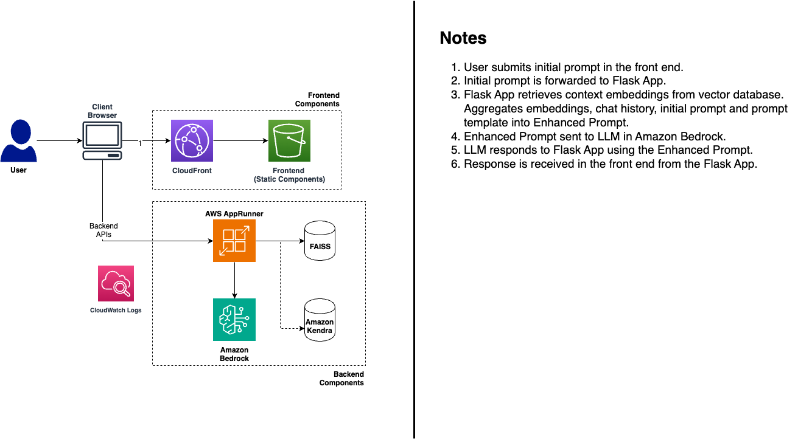
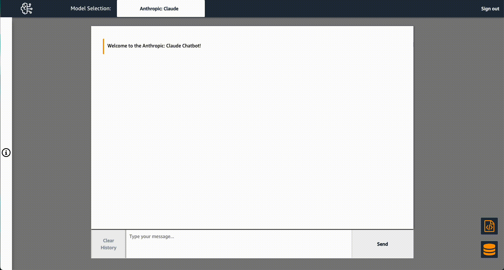

# RAG with AWS Bedrock and React

Use this solution to quickly and inexpensively begin prototyping and vetting business use cases for GenAI using a custom corpus of knowledge with Retrieval Augmented Generation (RAG) in a low-code ReactJS application.

This solution contains a backend Flask application which uses LangChain to provide PDF data as embeddings to your choice of text-gen foundational model via Amazon Web Services (AWS) new, managed LLM-provider service, Amazon Bedrock and your choice of vector database with FAISS or a Kendra Index.

The only cost-generating AWS service this solution uses is Amazon Bedrock.


## What You'll Build



## Screenshots




## Prerequisites

You'll need to install all prerequisites on your local operating machine.

    
For the Flask backend, you'll need to have:
1. [Python 3.8 or higher](https://www.python.org/downloads/macos/)
2. Set up the SDK for Python (Boto3) and AWS CLI
    - Boto3 & Botocore: `pip3 install ./backend/flask/boto3-1.26.162-py3-none-any.whl ./backend/flask/botocore-1.29.162-py3-none-any.whl`
    - AWS CLI: [Instructions Here](https://docs.aws.amazon.com/cli/latest/userguide/getting-started-install.html)
3. Install the requirements using the requirements file with `pip3 install -r ./backend/flask/requirements.txt`


For the React frontend, you'll need to install the following:
1. [Node.js & npm](https://docs.npmjs.com/downloading-and-installing-node-js-and-npm)
2. Install the NPM dependencies with `npm install`


## IAM Permission

Your flask backend will need permissions to call the Bedrock API. More specifically, it should have least privileged access to Invoke foundational models in Bedrock. To do this, you'll need to create an IAM user with the appropriate permissions, then generate access keys (cli credentials). Complete documentation of Bedrock IAM Reference configurations [found here.](https://docs.aws.amazon.com/service-authorization/latest/reference/list_amazonbedrock.html)

1. From the IAM console, perform the following steps:
2. Select the IAM Group associated with your user.
3. Click on "Add Permissions" and choose "Create Inline Policies" from the dropdown list.
4. Create a new inline policy and include the following permissions:
```
{
  "Version": "2012-10-17",
  "Statement": [
    {
      "Effect": "Allow",
      "Action": "bedrock:InvokeModel",
      "Resource": "*"
    }
  ]
}
```
Please note : When creating this IAM role, follow the best practice of granting [least privileged access.](https://docs.aws.amazon.com/IAM/latest/UserGuide/best-practices.html#grant-least-privilege)

6. Create programmatic access keys/CLI credentials.
7. Run `aws configure --profile <name_of_profile>'
7. On line 62 of `backend/flask/app.py`, include the name of your AWS CLI Profile you configured.
   


## How to Run

1. In one terminal session, cd into `./backend/flask` and execute `flask run`
2. In another terminal session, make sure your terminal cursor is anywhere inside of this repository's directory and execute `npm start`. The app will run in development mode and made available at http://localhost:3000/


## How to Use

Once you confirm that the app(s) are running, you can begin prototyping. 


### Add Your Own Corpus for RAG Embeddings 

PDF data is read from `./backend/flask/output` and stored in an in-memory vector database using FAISS when the Flask app is started. If you add or remove PDF data from the `./backend/flask/output` directory, you'll need to restart the Flask application for the changes to take effect.

Alternatively, you can use the database button in the lower right corner of the application to add or remove PDF documents manually or from S3 and subsequently reinstantiate the in-memory vector database, or instantiate a connection to a Kendra index. 


### Prompt Engineering with LangChain

Use the </> button just above the database button to update the Prompt Template: explicit instructions for how a text-gen model should respond.

Foundational Models are trained in specific ways to interact with prompts. Check out the [Claude Documentation Page](https://docs.anthropic.com/claude/docs) to learn best practices and find examples of pre-engineered prompts.


## License

This library is licensed under the MIT-0 License. See the LICENSE file.
